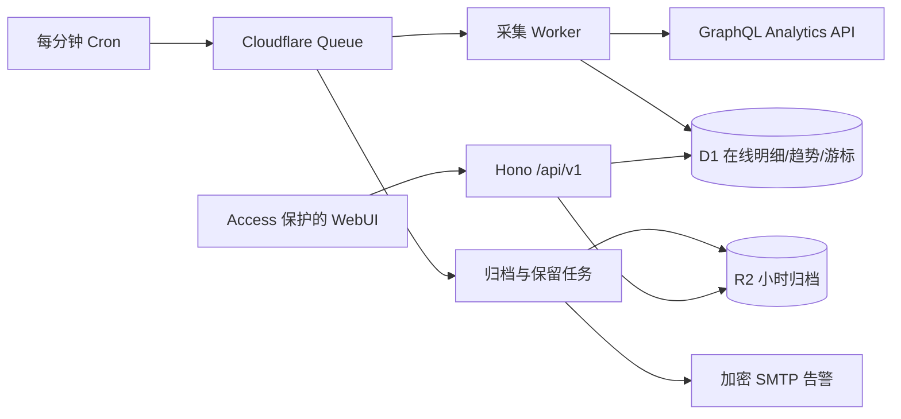

# CF Activity Observatory

[English](./README_EN.md) · [归档格式](./docs/ARCHIVE_SCHEMA.md) · [安全策略](./SECURITY.md)

CF Activity Observatory 是一个部署在 Cloudflare Workers 上的自托管 HTTP 活动与安全分析工具。它定期读取 Cloudflare GraphQL Analytics API，将短期可见的采样明细、采样校正趋势保存到 D1 与 R2，并提供可按几天、几周或几个月查看的 WebUI。

> 本项目与 Cloudflare, Inc. 没有官方关联。Cloudflare 是其各自所有者的商标。

## 先说清楚数据边界

这不是 Enterprise Logpush/Logpull 的替代品，也不声称保存未采样的逐请求全量日志。

- `httpRequestsAdaptive`：所有 HTTP 活动的采样明细，包括没有触发安全动作的请求。
- `httpRequestsAdaptiveGroups`：Cloudflare 依据自适应采样校正后的 HTTP 请求数和趋势。
- `firewallEventsAdaptive`：被安全产品处理或标记的采样事件明细。
- `firewallEventsAdaptiveGroups`：按安全动作、产品和规则计算的采样校正趋势。

明细行是真实发生过的请求样本，但不等于每一个请求。趋势图不会用“采样行数”冒充真实请求数，而使用 Groups 数据集的估算值。应用会从每个 Zone 的 GraphQL `settings` 动态读取可用字段、最大页大小、历史窗口与最大查询时长，因此不会硬编码不同套餐的保留天数。参见 Cloudflare 的 [数据集设置](https://developers.cloudflare.com/analytics/graphql-api/features/discovery/settings/) 与 [Adaptive Sampling](https://developers.cloudflare.com/analytics/graphql-api/features/sampling/)。

## 功能

- 每个 Zone 独立启停、1–1440 分钟轮询，默认 5 分钟。
- 首次按 `notOlderThan` 自动补采；持久化游标支持中断续跑。
- 只查询到当前时间前 5 分钟，每小时重查最近一小时以修复迟到数据。
- 饱和页面拆成独立 Queue 续传任务；子窗口完成前保留可见的数据缺口，避免单次 Worker 超出子请求限制。
- HTTP 与安全采样明细的组合筛选、URL 恢复、保存视图与键集分页。
- 校正请求/缓解趋势、动作分布、国家地图，以及 path、IP、ASN、User-Agent、规则的独立高基数 cube。
- D1 在线明细默认保留 90 天；每小时导出 gzip NDJSON 到 R2，校验完成后才允许清理在线行。
- 趋势数据只保留一层：90 天内为 5 分钟，之后原子替换为小时，730 天后再替换为每日；API 按页面所需粒度即时汇总，不在 D1 重复保存同一份趋势。
- Workers Free 额度预算：GraphQL 240 次/5 分钟软上限、Queue 20% 安全余量、历史回填最多使用 D1 每日写入额度的 20%，总写入达到 80% 时暂停并在 UTC 零点续传。
- Cloudflare Access JWT 验证、状态修改同源保护、严格安全响应头。
- SMTP 465 隐式 TLS / 587 STARTTLS 告警，仅在状态变化时发送，密码以 AES-GCM 加密保存。
- 简体中文与 English、深色/浅色/跟随系统、移动端适配与 reduced-motion。

## 架构



一个 Queue 消息只处理一个 Zone、一个数据集和一个有限时间窗口。所有时间在存储/API 中使用 UTC；前端按浏览器时区显示。

## 所需权限

创建一个范围尽可能小的 Cloudflare API Token：

- Account — Account Analytics — Read
- Zone — Analytics — Read
- Zone — Zone — Read
- Resources — 仅选择需要观测的账号或 Zone

Token 只通过 Worker Secret 或本地 `.dev.vars` 提供，不会写入 D1、R2、浏览器或应用日志。

## 本地开发

需要 Node.js 22+ 与 pnpm 10。

```bash
pnpm install
cp .dev.vars.example .dev.vars
openssl rand -base64 32
# 将 Token、密钥和 Access 测试配置填入 .dev.vars
pnpm cf-typegen
pnpm dev
```

首次启动前应用本地迁移：

```bash
node ./node_modules/wrangler/bin/wrangler.js d1 migrations apply DB --local
```

仓库位于含 `:` 的父目录时，POSIX `PATH` 无法正确表达该目录。项目脚本因此直接调用本地 Node CLI 入口，`pnpm dev/build/test` 无需额外处理。Cloudflare Vite 开发服务器本身仍可能受含 `:` 的绝对路径影响；此时使用：

```bash
pnpm build
pnpm preview
```

完整验证：

```bash
pnpm check
```

## 部署

### 1. 登录并创建资源

```bash
node ./node_modules/wrangler/bin/wrangler.js login
node ./node_modules/wrangler/bin/wrangler.js d1 create cf-activity-observatory
node ./node_modules/wrangler/bin/wrangler.js r2 bucket create cf-activity-observatory-archives
node ./node_modules/wrangler/bin/wrangler.js queues create cf-activity-observatory
node ./node_modules/wrangler/bin/wrangler.js queues create cf-activity-observatory-dlq
```

如果 `d1 create` 返回 `database_id`，将它添加到 `wrangler.jsonc` 的 D1 项。新版 Wrangler 支持按名称自动配置时，可保持当前配置。

### 2. 设置 Secrets

```bash
node ./node_modules/wrangler/bin/wrangler.js secret put CLOUDFLARE_API_TOKEN
openssl rand -base64 32 | node ./node_modules/wrangler/bin/wrangler.js secret put CONFIG_ENCRYPTION_KEY
node ./node_modules/wrangler/bin/wrangler.js secret put ACCESS_TEAM_DOMAIN
node ./node_modules/wrangler/bin/wrangler.js secret put ACCESS_AUD
```

### 3. 迁移与部署

```bash
node ./node_modules/wrangler/bin/wrangler.js d1 migrations apply DB --remote
pnpm check
pnpm wrangler:dry-run
pnpm deploy
```

部署后为 Worker 添加自定义域名。项目关闭了 `workers.dev` 和 Preview URL，避免绕过 Access。

### 4. 配置 Cloudflare Access

1. Zero Trust → Access → Applications → Add an application → Self-hosted。
2. 将 Worker 自定义域名作为应用域名。
3. 配置 GitHub OAuth 或其他身份源与 Allow 策略。
4. 把 Team domain 和 Application AUD 写入上面的 Secrets。
5. 未登录访问 WebUI 应被 Access 拦截；登录后 `/api/v1/me` 应返回验证过的邮箱。

Worker 会按照 Cloudflare 的 [Access JWT 验证方式](https://developers.cloudflare.com/cloudflare-one/access-controls/applications/http-apps/authorization-cookie/validating-json/)校验 RS256 签名、issuer 和 AUD。不要只依赖前端页面是否被 Access 隐藏。

## 首次使用

1. 登录 WebUI，打开“设置与健康”。
2. 点击“发现 Cloudflare Zone”。
3. 启用需要的 Zone，设置轮询间隔与在线保留天数。
4. 检查四个数据集的动态能力；不可用字段会显示“当前套餐或 API 不提供”。
5. 可选配置 SMTP；保存后再发送测试邮件。
6. 等待两个实时轮询周期，确认游标、趋势、采样明细与 R2 归档出现。

## 免费额度估算

默认按 Workers Free 的常见额度设计。单 Zone、四个数据集、5 分钟频率的基础 Queue 发送/接收/确认估算约 3456 次/日，另外预留修复、重试、归档和用户其他调用。设置页计算所有 Zone 的预计消耗；超过 8000 次/日会拒绝保存。

历史回填与实时采集使用不同写入水位：回填达到 20,000 行后延迟到下一个 UTC 日，实时任务可继续使用剩余额度；总写入达到 80,000 行时记录暂停区间，并在额度重置后自动拆分补采。D1 计费会把索引更新计为额外写入，因此明细只保留时间范围查询所需的索引，趋势表使用复合主键和一棵查询索引，并且不会同时写入 5 分钟、小时、每日三份副本。

Cloudflare 产品额度可能调整，以部署时的官方套餐页为准。程序记录自身产生的 GraphQL、Queue、D1 和 R2 估算，不代表账号中其他应用的用量。

## 归档与升级

R2 key：

```text
archives/{zone_id}/{dataset}/YYYY/MM/DD/HH.ndjson.gz
```

对象第一行是 schema 元数据，后续每行是一条 D1 导出记录。详细格式、校验与恢复方式见 [docs/ARCHIVE_SCHEMA.md](./docs/ARCHIVE_SCHEMA.md)。

升级前备份 D1/R2，拉取新版本，执行远端 migration，再部署：

```bash
git pull --ff-only
pnpm install --frozen-lockfile
node ./node_modules/wrangler/bin/wrangler.js d1 migrations apply DB --remote
pnpm deploy
```

Worker 代码可通过重新部署上一 Git tag 回滚；包含破坏性数据迁移的版本会在 Release Notes 单独说明。

## 安全与隐私

- 不采集请求体、Cookie、Authorization 等请求头。
- 会保存 IP、完整 query、User-Agent 等调查字段；请按所在地法律设置保留期和访问权限。
- 敏感请求字段不会进入结构化日志、错误摘要或 SMTP 正文。
- SMTP 密码由 32 字节 `CONFIG_ENCRYPTION_KEY` 使用 AES-GCM 加密；丢失密钥后只能重新填写密码。
- 应用 Cron 完全停止时无法自我发送故障邮件。建议用外部监控检查 `/api/v1/health`，外部监控同样应通过 Access Service Token。
- 安全问题请按 [SECURITY.md](./SECURITY.md) 私下报告。

## API

所有接口位于 `/api/v1`，返回 `Cache-Control: no-store`。主要端点：

- `GET /me`, `/zones`, `/metrics`, `/requests`, `/security-events`, `/archives`, `/health`
- `POST /zones/discover`, `/saved-views`, `/settings/smtp/test`
- `PUT /zones/:id`, `/saved-views/:id`, `/settings/smtp`
- `GET /export?type=requests&format=csv|json|ndjson`

明细列表按 `(occurred_at, id)` 键集分页。contains 查询应限制时间范围；CSV 会防护 `= + - @` 公式注入。

## 许可证

[GNU Affero General Public License v3.0 only](./LICENSE)。通过网络向用户提供修改版本时，请遵守 AGPL 的对应源码义务。
